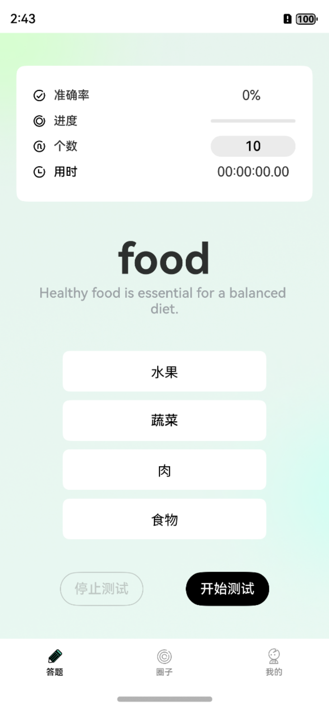
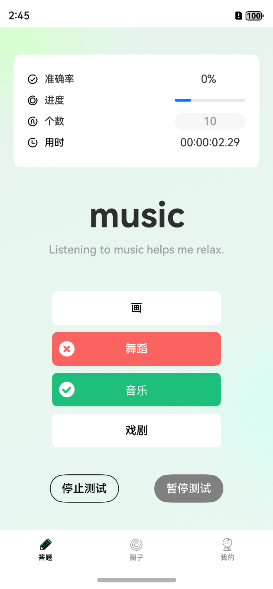

# EngLearnHm

鸿蒙开发练习之英语单词打卡

**项目简介**

本项目是一个基于HarmonyOs开发的英语学习应用，主要核心功能是辅助单词记忆以及分享打卡圈。

项目展示：

功能特性

📚 单词记忆：选择单词的答案

⌛️ 时间计算：练习单词的时间计算

🛜 数据请求：快速获取测试数据

🖼️ 布局和谐：简约易操作的布局样式

技术栈

本项目使用了以下技术和工具：

1. 常用布局的使用：Column、Row等等

2. 常用组件的使用：Progress、Button、Image、Text、TextTimmer（计时器）Tabs组件等等

3. 自定义组件、自定义弹窗

4. 组件状态管理：@State、@Prop、@Link、@Watch等等

5. 组件动画效果

6. 页面路由(router)

7. 组件生命周期钩子函数

8. 网络请求 (axios)

9. 应用级状态管理(PersistentStorage)

10. 事件通知(emitter)

安装与使用

1. 环境要求

DevEco Studio 5.0.1

HarmonyOS 5.0.1

2. 安装步骤

克隆仓库

git clone https://github.com/yooD77/EngLearnHm.git

cd your-repo

导入项目

使用 DevEco Studio 打开项目

运行应用

连接真机或启动模拟器

运行Index

对应的后台数据HttpServer文件夹，请在尚硅谷鸿蒙英语打卡项目的学习中资料下载。

路径尚硅谷教育vx公众号，回复“鸿蒙”领取🆓配套资料
